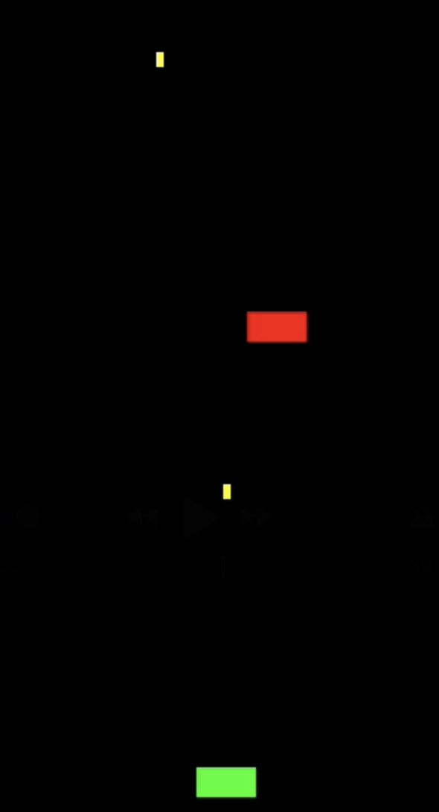
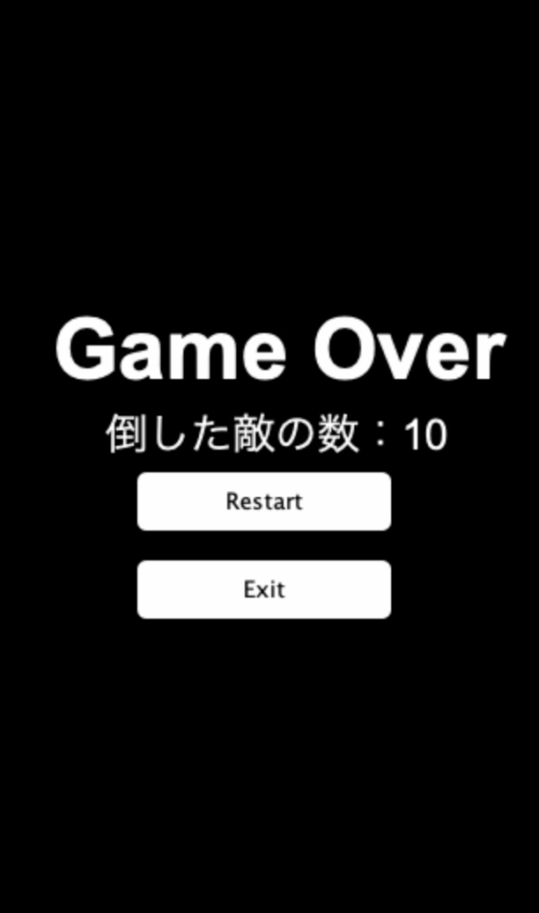

# Java Shooting Game 🎮

JavaとSwingを使って作成した、2Dシューティングゲームです。  
オブジェクト指向設計に沿ってクラス分割を行い、プレイヤー・弾・敵などの管理を明確にしました。  
ゲームオーバー時にはスコア表示、リスタート・終了ボタンも搭載しています。

---

## 🚀 ゲーム概要

- プレイヤーを左右に動かし、スペースキーで弾を発射
- 敵に弾を当てるとスコア加算
- 敵を見逃して画面下まで到達するとゲームオーバー
- リスタート＆終了ボタンで操作可能

---

## 🖼 ゲーム画面

### 🎯 プレイ中

### 💥 ゲームオーバー

---

## 🧩 使用技術

- Java（JDK 17）
- Swing（JFrame, JPanel, Timer, JButtonなど）
- オブジェクト指向（`Player`, `Bullet`, `Enemy`, `GamePanel`）

---

## ▶️ 実行方法

1. Java 17以降をインストール
2. このリポジトリをクローンまたはダウンロード
3. IntelliJ IDEA などのIDEで `Main.java` を実行

---

## 📝 ライセンス

MIT License

